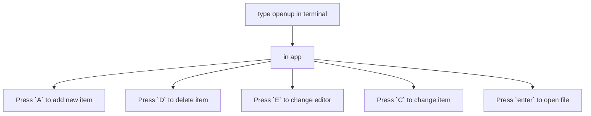

# OpenUp
___
[install](#installation) | [unistall](#uninstall) | [keybinds](#keybinds)

### About
> this is simple tui for opening project, config, etc files.

### How to use


<p align="center">

</p>

### Installation:

#### Linux:

```bash
go install github.com/Horryportier/openup@latest 
```
### Uninstall:

#### Linux:

```bash
   rm -rf ~/.openup
   rm ~/go/bin/openup
```


## To implement
- [ ] lunch tmux/kitty session
- [ ] help for all views

## keybinds

- standard bubbletea list bindings
- change existing item {C} not working 
- delete item {D}
- add item {A}
- change editor {E}

