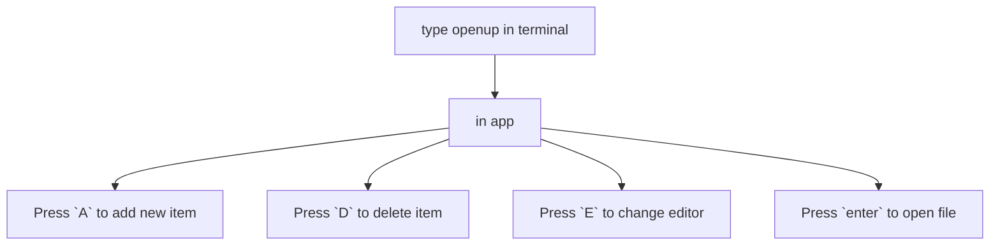

# OpenUp
___

### About
> this is simple tui for opening project, config, etc files.

### How to use




### Installation:

#### Linux:

```bash
   git clone https://github.com/Horryportier/openup
   cd openup
   chmod +x install.sh
   ./install.sh
```

## To implement
- [x] Adding/delting items
- [x] adding data to json
- [x] choice of editor
- [x] un/install script
- [x] better style
- [ ] changing existing item
- [x] custom key binds

## keybinds (may change)

- standard bubbletea list bindings
- change existing item {c} not working 
- delete item {D}
- add item {A}
- change editor {E}

